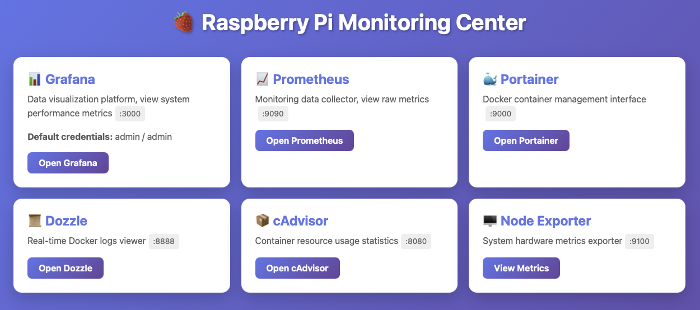
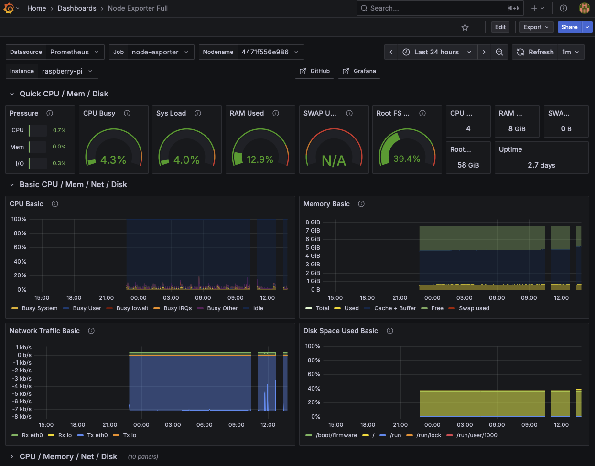
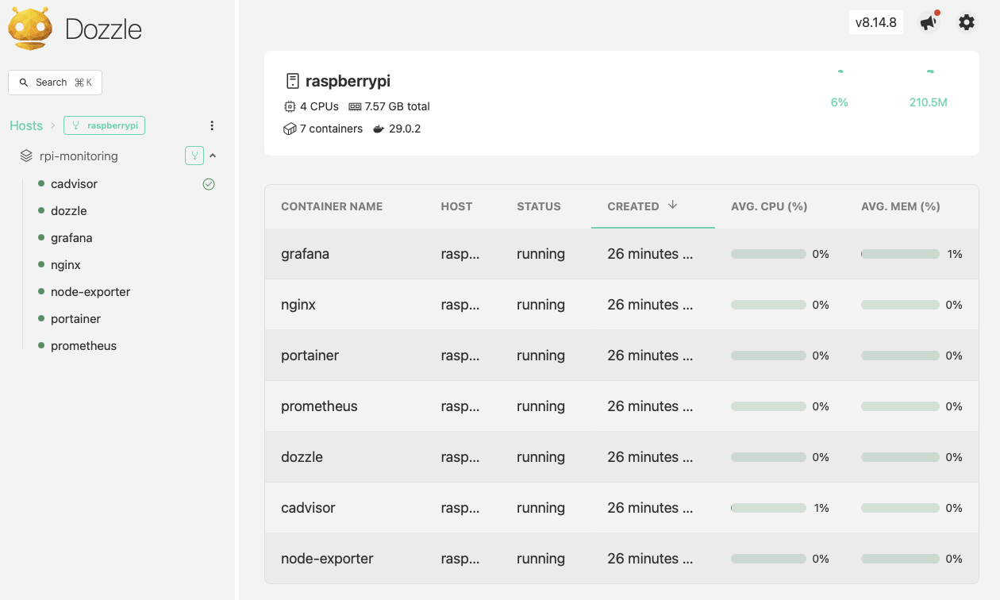
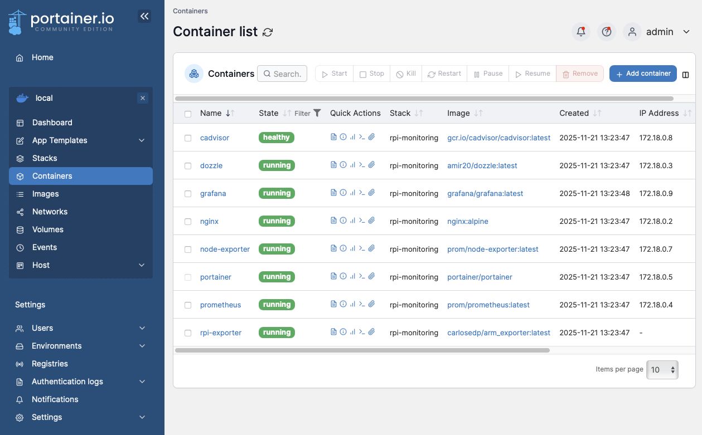

# Docker Monitoring Stack

A comprehensive monitoring and management solution for Docker environments, featuring real-time metrics, visualization, and container management capabilities.

## 🚀 Features

- **Container Management** - Portainer web UI for Docker administration
- **Real-time Logs** - Dozzle for live container log streaming
- **Metrics Collection** - Prometheus for time-series data storage
- **System Monitoring** - Node Exporter for hardware and OS metrics
- **Container Metrics** - cAdvisor for Docker container performance
- **Visualization** - Grafana dashboards for data analysis
- **Web Server** - Nginx for serving static content
- **Hardware Monitoring** - Raspberry Pi temperature tracking

### Monitor Center

### Grafana Dashboard

### Dozzle Dashboard

### Portainer Dashboard

## 📋 Prerequisites

- Docker Engine 20.10+
- Docker Compose 3.8+
- 2GB+ RAM recommended
- Linux-based system (tested on Raspberry Pi)

## 🛠️ Installation

1. Clone the repository:
```bash
git clone <repository-url>
cd <project-directory>
```

2. Create required directories:
```bash
mkdir -p nginx/{html,conf.d,logs}
mkdir -p prometheus/rules
mkdir -p grafana/{provisioning,dashboards}
mkdir -p node-exporter/textfile_collector
```

3. Create Prometheus configuration:
```bash
touch prometheus/prometheus.yml
```

4. Start the stack:
```bash
docker-compose up -d
```

5. View deployment information:
```bash
echo "
✅ Deployment Complete!

Access URLs:
- Homepage: http://$(hostname -I | awk '{print $1}')
- Grafana: http://$(hostname -I | awk '{print $1}'):3000
- Prometheus: http://$(hostname -I | awk '{print $1}'):9090
- Portainer: http://$(hostname -I | awk '{print $1}'):9000
- Dozzle: http://$(hostname -I | awk '{print $1}'):8888

Default Credentials:
- Grafana: admin / admin

Remember to replace YOUR_PI_IP with your actual Raspberry Pi IP address in the homepage HTML!
"
```

## 🌐 Access Points

| Service | URL | Default Credentials |
|---------|-----|---------------------|
| Nginx | http://localhost:80 | - |
| Portainer | http://localhost:9000 | Set on first access |
| Dozzle | http://localhost:8888 | - |
| Prometheus | http://localhost:9090 | - |
| Grafana | http://localhost:3000 | admin / admin |
| cAdvisor | http://localhost:8080 | - |
| Node Exporter | http://localhost:9100/metrics | - |
| RPi Exporter | http://localhost:9243/metrics | - |

## 📊 Resource Limits

- **Nginx**: 128MB
- **Portainer**: 256MB
- **Dozzle**: 128MB
- **Prometheus**: 512MB
- **Node Exporter**: 128MB
- **cAdvisor**: 256MB
- **Grafana**: 512MB
- **RPi Exporter**: 64MB

**Total**: ~2GB RAM

## 🔧 Configuration

### Prometheus
Edit `prometheus/prometheus.yml` to configure scrape targets and alerting rules.

### Grafana Setup Guide

After starting all services, Grafana will be empty. Follow these steps to configure it:

#### Step 1: Login to Grafana
- Visit `http://your-server-ip:3000`
- Default credentials: `admin` / `admin` (you'll be prompted to change the password on first login)

#### Step 2: Add Data Source
1. Click the gear icon in the left menu **Connections** (or Settings icon) -> **Data Sources** -> **Add data source**
2. Select **Prometheus**
3. In **Prometheus server URL**, enter: `http://prometheus:9090`
   - ⚠️ **Important**: This must be the container name `prometheus`, not the IP address
4. Scroll down and click **Save & test**
   - If you see a green checkmark, the connection is successful

#### Step 3: Import Dashboard
1. Click the menu icon in the left -> **Dashboards** -> **New** -> **Import**
2. In **Import via grafana.com**, enter the dashboard ID: **1860** (Node Exporter Full dashboard)
3. Click **Load**
4. At the bottom, select **Prometheus** from the dropdown menu
5. Click **Import**

🎉 **Done!** You can now view real-time metrics including CPU load, memory usage, disk space, and network traffic in beautiful visualizations.

### Nginx
Place your static files in `nginx/html/` and configuration in `nginx/conf.d/`.

## 📝 Usage

### View container logs:
```bash
# Access Dozzle at http://localhost:8888
```

### Manage containers:
```bash
# Access Portainer at http://localhost:9000
```

### Query metrics:
```bash
# Access Prometheus at http://localhost:9090
# Access Grafana at http://localhost:3000
```

### Stop the stack:
```bash
docker-compose down
```

### Stop and remove volumes:
```bash
docker-compose down -v
```

## 🔒 Security Notes

- Change default Grafana credentials immediately
- Consider using reverse proxy with SSL/TLS for production
- Restrict port access using firewall rules
- Review and update container images regularly

## 🐛 Troubleshooting

### Portainer shows Podman error:
Ensure the environment is configured for Docker, not Podman.

### Permission denied errors:
Check Docker socket permissions: `/var/run/docker.sock`

### High memory usage:
Adjust resource limits in `docker-compose.yml` as needed.

## 📦 Data Persistence

The following volumes persist data across restarts:
- `portainer_data` - Portainer configuration
- `prometheus_data` - Metrics data (30-day retention)
- `grafana_data` - Dashboards and settings

## 🤝 Contributing

Contributions are welcome! Please submit pull requests or open issues for bugs and feature requests.

## 📄 License

This project is open source and available under the MIT License.

## 🙏 Acknowledgments

Built with:
- [Docker](https://www.docker.com/)
- [Prometheus](https://prometheus.io/)
- [Grafana](https://grafana.com/)
- [Portainer](https://www.portainer.io/)
- [Dozzle](https://dozzle.dev/)
- [cAdvisor](https://github.com/google/cadvisor)
- [Node Exporter](https://github.com/prometheus/node_exporter)